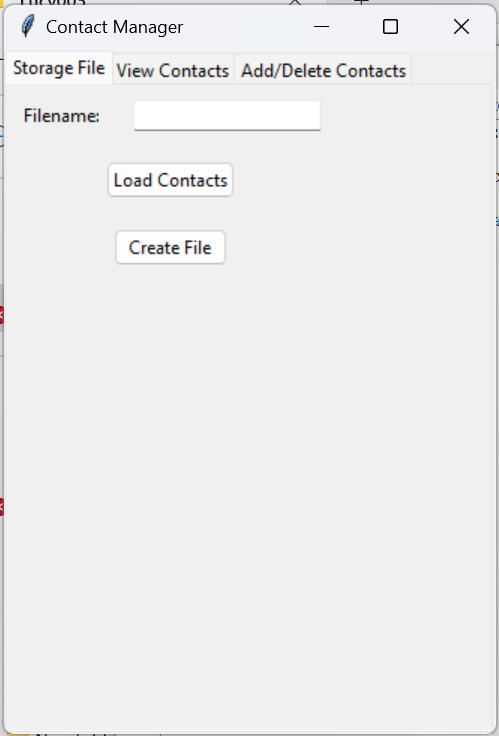
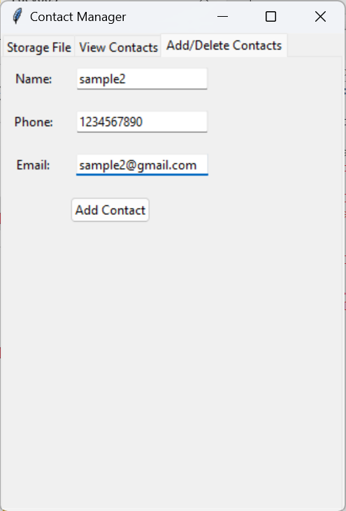
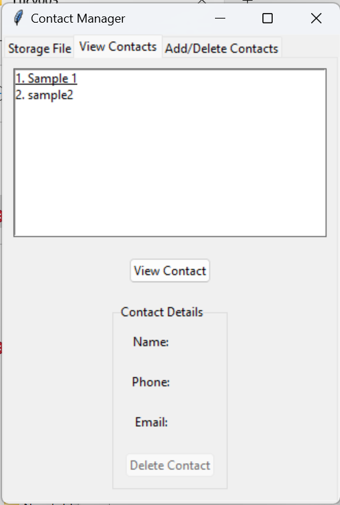
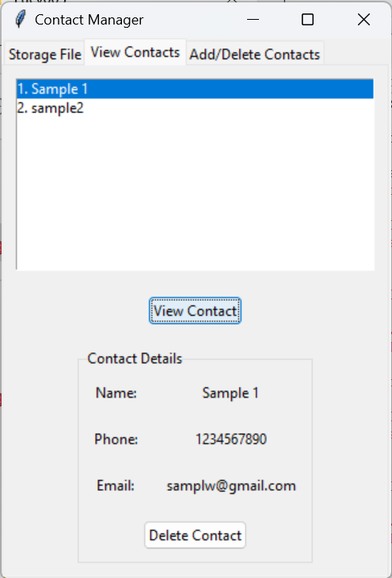

# Contact Management System

## Hello Users!!!

Welcome to the Contact Management System program. This program is created using Python programming language. It consists of features to load a contact storage file, create a storage file if it does not exist, and perform actions such as adding, viewing, and deleting contacts. The storage file is in CSV format. Below are the images demonstrating the deployed code.

### Table of Contents
- [Initial Page](#initial-page)
- [Adding Contact](#adding-contact)
- [Viewing Contacts](#viewing-contacts)
- [Viewing Contact Details](#viewing-contact-details)

### Initial Page

This page displays tabs to perform actions. The initial tab is the storage tab where you can load or create a storage file.

### Adding Contact

This page shows the feature of adding a new contact to the storage file.

### Viewing Contacts

This page displays the list of contacts. Click on a contact and press the view button to see the full contact details.

### Viewing Contact Details

This page shows the details of a selected contact with an option to delete the contact from the storage.
